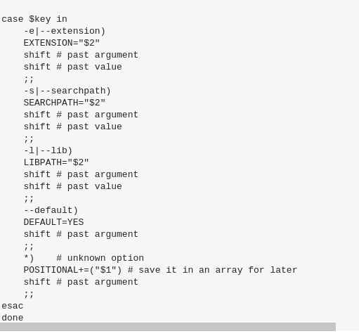
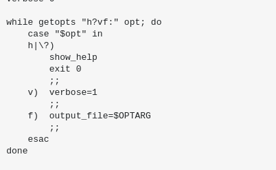

# Wonderful Argument Parser

A simple bash function signature parser that turns function comments into a usable CLI. No bucket or mop required, this library takes care of all the mess.

## Alternatives?

Case & Loop                               | Getopt
---                                       | ---
 | 
Not something to write dozens of times    | Completely incomprehensible for newcomers.

Very ugly.

## Instead, WAP

```bash
# Load the Wonderful Argument Parser library
. wap.sh

# Define our function
fn() { ## <req1> <req2> [--weeks=1] [--email=user@host] [--flag1] [--flag2]

	# These variables are auto-magically set.
	echo "  req1=$arg_req1"
	echo "  req2=$arg_req1"
	echo " weeks=$arg_weeks"
	echo " email=$arg_email"
	echo " flag1=$arg_flag1"
	echo " flag2=$arg_flag2"
}

# Parse the arguments, do the magic
wonderful_argument_parser fn $@

# Call the function
fn
```

## Function Discovery

For easiest usage, just call WAPify

```bash
#!/bin/bash

# Load the Wonderful Argument Parser library
. wap.sh

# Define our function
fn1() { ## <hello> <world>
	wap_help <<-EOF
		This does a lot of things with very many arguments. Prints out all of the arguments.
	EOF
	...
}

fn2() { ## <some> <other> [--args]
	wap_help <<-EOF
		This does something else, with some other arguments.
	EOF
	...
}


# Discover functions, handle unknown functions, help, etc.
wapify $@
```

Compatible functions will be auto-discovered, help menus rendered when necessary (--help | -h), and a function list provided, should they invoke the command without arguments.

Mandatory arguments are ensured:

```
$ ./example.sh
Required argument <something> is missing
Required argument <sth2> is missing
```

and

```
./example.sh a b c d e
Error: more positional arguments than should be possible
```

## Variables

Var               | Usage
----------------- | ---
`WAP_SHOULD_EXIT` | If this is set, then it will **not** exit
`WAP_DEBUG`       | If this is set, then some debugging info will be printed


## Q & A

Q  | A
-- | --
Why no short flags | Something something be explicit everywhere

## License

GPL-3.0
